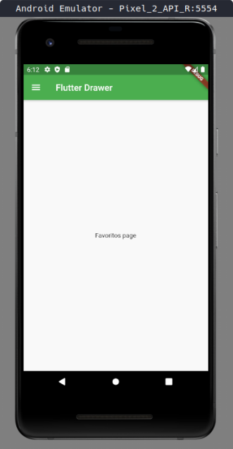
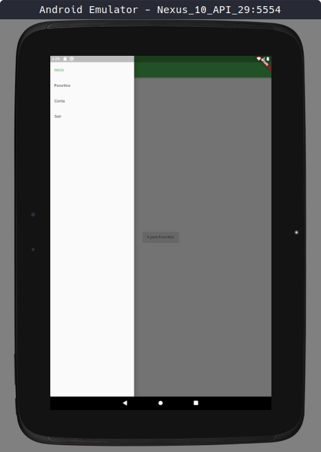
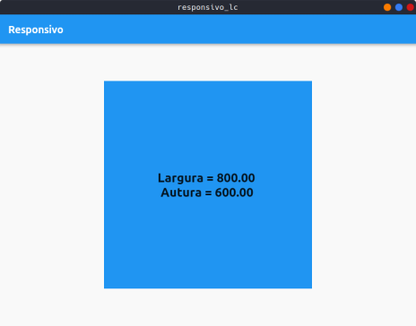
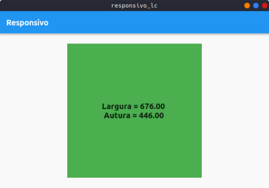
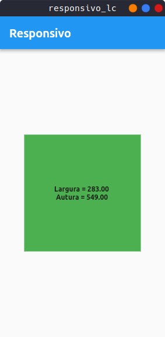

<h1>Exemplos Flutter</h1>

<h3>Este repositório contem exemplos de programação com Flutter, destinado a estudo de progamadores iniciantes, desenvolvido no curso Flutter - Aprendendo tudo sobre Design do Jacob Moura (@jacobaraujo7)</h3>

1. drawer_com_setstate - exemplo de navegação com drawer usando o método setState() para atualizar a aplicação.
2. navegacao_drawer_sem_setstate - exemplo de navegação com drawer mais eficiente
3. drawer - implementação final do drawer utilizando rxdart
4. responsivo - um exemplo de tela responsiva (...só cria um container com tamanho ajustável a tela, com altura e largura mínima e máxima)
5. reponsivo_lc - nova versão do responsivo com LayoutBuilder (roda no Flutter web e Desktop)

Em breve mais exemplos...
